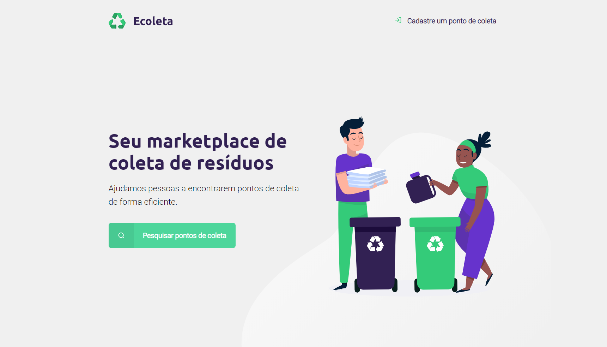
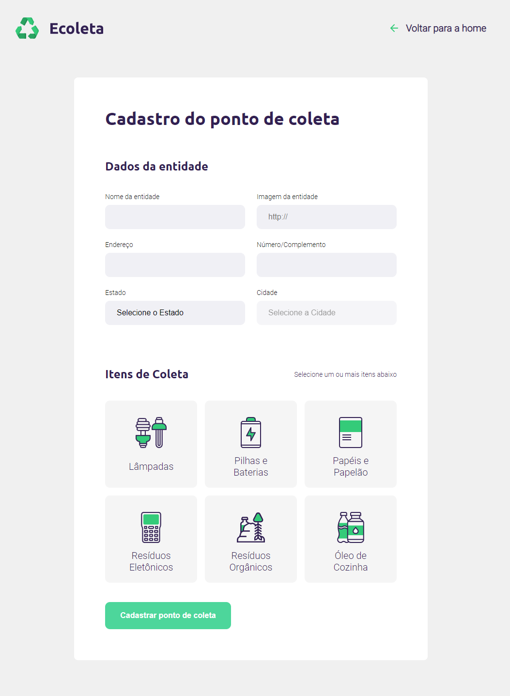
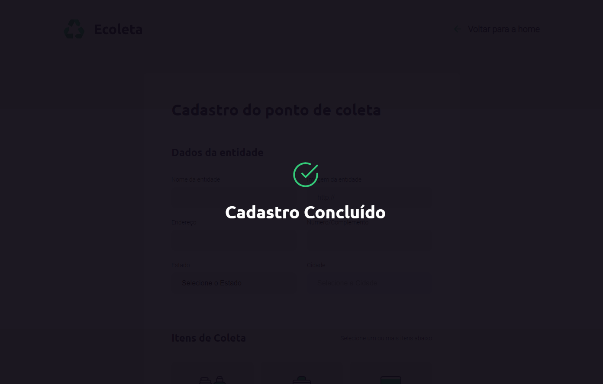
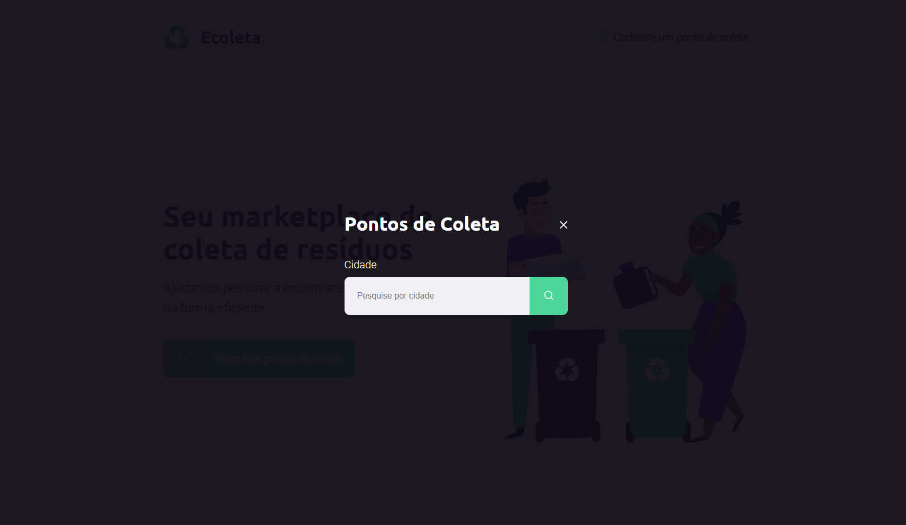
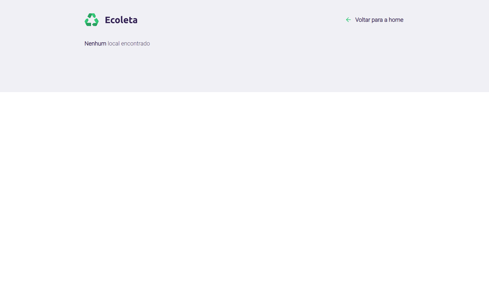
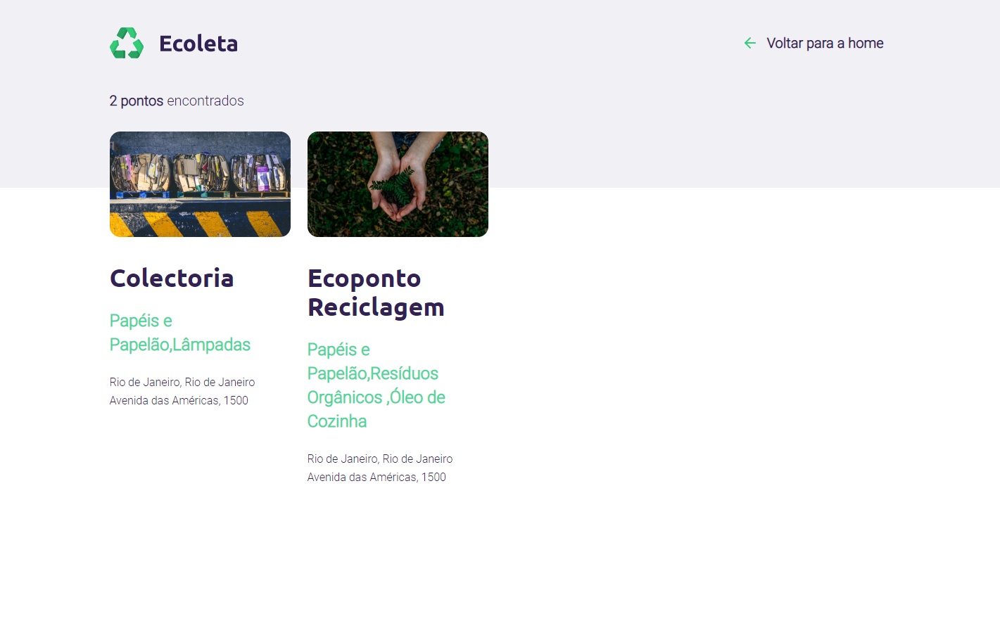

# Next-Level-Week
 Projeto realizado durante a Next Level Week, da Rocketseat
 
 ## Sobre
 
 O Ecoleta é um site que permite o cadastro de empresas de reciclagem de uma forma rápida e intuitiva.
 
 ### Tecnologias utilizadas:  

:space_invader: Front-end:        
* Nunjucks:  
  - HTML 5     
  - CSS 3     
  - JavaScript     
  
:space_invader: Back-end:  
* NodeJS
  - Express  
  - Nodemon 

* SQLite3  
* APIs   
  - IBGE   
 
 
 ### Prints do Projeto
 

